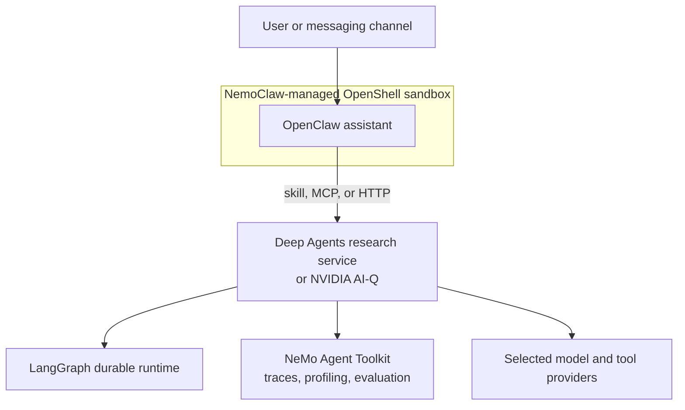

# Agent Systems Lab

An implementation-first study of reliable, inspectable agent systems—from
explicit LangGraph state and bounded tool loops to evaluated research workflows
and sandboxed assistant runtimes.

> **Status:** Phase 1 is active. The repository currently contains the
> low-level LangGraph foundation; the higher-level application and runtime
> layers described below are planned, not yet implemented.

## Why this repository exists

Agent frameworks make useful systems easier to build, but their abstractions
can hide the mechanisms that determine reliability: state transitions, message
ordering, routing, loop termination, persistence, approvals, tool failures, and
runtime permissions.

This project starts one layer lower. It makes those mechanisms observable in a
small executable graph, then moves upward to higher-level frameworks only when
they solve a demonstrated need. The intended result is both a learning record
and a reproducible portfolio project showing how application behavior,
evaluation, model access, and security boundaries fit together.

The project is deliberately **not** an attempt to recreate a complete agent
framework in raw LangGraph.

## What works today

- A typed `StateGraph` with explicit state, deterministic routing, and
  reducer-backed message history.
- Streamed state snapshots that make each graph transition visible.
- A pinned NVIDIA-hosted model integration with response and usage metadata.
- A deterministic local `count_words` tool and a verified manual
  model → tool → `ToolMessage` → model round trip.
- A compiled multi-round tool graph with model routing, `ToolNode` execution,
  explicit round accounting, natural termination, and forced final-answer
  synthesis after at most three tool rounds. Its credentialed runner has
  executed a structured tool request and naturally exited after the result.
- Credential-free reliability probes showing that `ToolNode` propagates
  exceptions from valid tool execution by default and that a LangGraph
  `RetryPolicy` can retry a failed node without committing failed attempts.
- A locked Python 3.12 environment, sanitized credential template, and written
  model/secret policy.
- A credential-free pytest baseline covering tool routing, round accounting,
  response rendering/filtering, compiled bounded topology, and deterministic
  three-round execution through forced finalization.

The current checkpoint is a bounded cycle:
`model -> tools -> increment_tool_round -> model` while fewer than three tool
rounds have completed. An ordinary model answer terminates naturally; reaching
the limit routes to the unbound `final_response` node and then `END`. A
credentialed NVIDIA run naturally exited after one tool round, while a
scripted-model test verified exactly three rounds followed by forced synthesis.

## Target system

This is the integration direction, not the current repository state:



The repository is the shared narrative and integration surface. Components
with different dependencies or lifecycles will keep separate packages,
environments, processes, and runtime state.

## Roadmap

| Phase | Focus | State |
| --- | --- | --- |
| 0 | Repository boundaries, secrets, provider policy, and cost controls | Baseline in place |
| 1 | LangGraph state, tools, bounded loops, checkpoints, and interrupts | In progress |
| 2 | Useful research assistant built with Deep Agents | Planned |
| 3 | NeMo Agent Toolkit profiling and evaluation | Planned |
| 4 | NVIDIA AI-Q operation, architecture study, and one extension | Planned |
| 5 | OpenClaw as an always-on assistant runtime | Planned |
| 6 | OpenShell policy and credential-isolation experiments | Planned |
| 7 | NemoClaw-managed operation, rebuild, and recovery | Planned |
| 8 | Integrated demo, evaluation evidence, and threat model | Planned |

Each phase must produce a working happy path, an important failure or denial
path, an inspectable artifact, and a concrete reason to advance. The detailed
deliverables and exit criteria are in [`docs/ROADMAP.md`](docs/ROADMAP.md).

## Quick start

### Prerequisites

- Python 3.12
- `uv`

Clone the repository and recreate the locked environment:

```sh
git clone https://github.com/stasbebra2006/agent-systems-lab.git
cd agent-systems-lab
uv sync --locked
```

Run the current deterministic research branch without a provider credential:

```sh
printf '%s\n' \
  'Explain why explicit graph state improves debuggability in agent systems' \
  | uv run python -m langgraph_learning.runners.routing
```

The streamed output should show the initial state, the router selecting the
`research` branch, and the final accumulated human/AI message history.

Run the current retry probe from the editable inspection workbench:

```sh
uv run python -m langgraph_learning.runners.playground
```

The output should show three node attempts but only one streamed update from the
successful attempt; no provider credential is required.

### Credentialed NVIDIA demos

Copy the sanitized template and add a dedicated NVIDIA API Catalog development
key locally:

```sh
cp .env.example .env
chmod 600 .env
```

Never commit the populated `.env`.

Test the provider connection and inspect its metadata:

```sh
uv run --env-file .env python -m langgraph_learning.runners.model_call
```

Run the isolated structured-tool protocol:

```sh
uv run --env-file .env python -m langgraph_learning.runners.manual_tool_call
```

Stream the bounded tool graph:

```sh
uv run --env-file .env python -m langgraph_learning.runners.tool_loop
```

These commands make external model requests. Run the deterministic,
credential-free test suite separately:

```sh
uv run pytest
```

## Repository structure

```text
src/langgraph_learning/
├── graphs/                   # reusable states, nodes, routes, and graph topology
├── runners/                  # executable streams, protocol probes, and playground
├── tools/                    # focused local tool modules
├── models.py                 # shared model selection and construction
└── __init__.py               # package marker
tests/                        # deterministic graph and runner behavior
docs/ROADMAP.md               # phases, deliverables, and exit criteria
docs/LEARNING_WORKFLOW.md     # one-change-at-a-time learning loop
docs/MODEL_ACCESS.md          # provider, reproducibility, and secret policy
docs/memory/                  # canonical project status and session continuity
```

Future phase-specific directories will be created only when their phase begins.
Complete upstream repositories, real conversations, checkpoints, databases,
credentials, and mutable assistant state do not belong in this repository.

## Engineering principles

- **Make state visible.** Stream or test every meaningful transition.
- **Bound autonomous behavior.** Loops, retries, concurrency, and costly
  operations need explicit limits.
- **Build vertical slices.** Connect one new mechanism to the smallest safe
  executable path before adding another.
- **Separate responsibilities.** Application behavior, evaluation,
  orchestration, and sandbox policy should not collapse into one process.
- **Pin what affects evidence.** Record exact models, providers, dependencies,
  datasets, and configuration for comparisons.
- **Keep credentials outside Git.** Version variable names and sanitized
  examples, never secret values or sensitive runtime artifacts.

## Project documentation

- [`docs/ROADMAP.md`](docs/ROADMAP.md) — system-level learning and portfolio
  roadmap
- [`docs/LEARNING_WORKFLOW.md`](docs/LEARNING_WORKFLOW.md) — collaboration and
  implementation cadence
- [`docs/MODEL_ACCESS.md`](docs/MODEL_ACCESS.md) — model selection,
  reproducibility, cost, and secret practices
- [`docs/memory/PROJECT.md`](docs/memory/PROJECT.md) — current implementation
  facts and next action

The LangChain Academy Introduction to LangGraph is used as a coverage map, while
implementation decisions are checked against the installed package behavior and
current official documentation.

## Maturity

This is an evolving learning and portfolio repository, not a production-ready
agent platform. Credentialed examples can consume provider quota, and future
runtime/security claims will be accompanied by reproducible demonstrations
before they are presented as completed.
